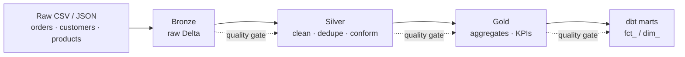

<div align="center">

# 🛒 Retail Lakehouse Pipeline

### Production-grade batch **data lakehouse** — **1M+ records** flowing through a **Medallion architecture** with **PySpark · Delta Lake · dbt · Airflow**, guarded by **15+ automated data-quality checks**.

<br/>


</div>

---

## 📑 Table of Contents

- [🎯 Overview](#-overview)
- [⚙️ Scale & Performance](#️-scale--performance)
- [🏗️ Architecture](#️-architecture)
- [🧰 Tech Stack](#-tech-stack)
- [🔍 Data Quality Framework](#-data-quality-framework-15-checks)
- [📂 Project Structure](#-project-structure)
- [🚀 Quick Start](#-quick-start)
- [💡 Key Engineering Decisions](#-key-engineering-decisions)

---

## 🎯 Overview

An end-to-end, **production-style batch data lakehouse** that ingests raw retail data, processes it through a **Medallion architecture (Bronze → Silver → Gold)** using **PySpark + Delta Lake**, models analytics marts with **dbt**, and orchestrates everything with **Apache Airflow** — with built-in **data-quality gates at every layer**.

It is **runnable end-to-end on a laptop** via Docker, yet mirrors how teams build on **AWS EMR + S3 + Databricks** in production. The sample generator produces **1M+ records** by default so the pipeline exercises genuine Spark/Delta scale — the same patterns I use day-to-day building and migrating pipelines for **Expedia, Atlassian, and Adidas**.

---

## ⚙️ Scale & Performance

| Aspect | Value |
| :--- | :--- |
| 📦 Records processed | **1M+** (1,000,000 orders + 50,000 customers + 2,000 products) |
| 🧱 Layers | Bronze → Silver → Gold (Delta Lake) |
| ✅ Data-quality gates | **15+ automated checks** across all layer transitions |
| 🔁 Idempotency | Re-runnable without duplicates (Delta `MERGE`) |
| ☁️ Run anywhere | Local laptop (Docker) or AWS EMR + S3 |

> ⚡ **Quick smoke run** (fewer rows): `python data/generate_sample_data.py --orders 20000 --customers 1000`

---

## 🏗️ Architecture



The entire flow is orchestrated by **Apache Airflow**: `ingest → quality → silver → quality → gold → dbt → publish`.

**Medallion layers**

| Layer | Purpose | Tech |
| :--- | :--- | :--- |
| 🥉 **Bronze** | Raw ingestion, schema-on-read, append-only history | PySpark + Delta |
| 🥈 **Silver** | Cleaned, deduplicated, type-cast, conformed | PySpark + Delta |
| 🥇 **Gold** | Business-level aggregates and KPIs | PySpark + Delta |
| 📊 **Marts** | Analytics-ready dimensional models | dbt |

---

## 🧰 Tech Stack

| Category | Tools |
| :--- | :--- |
| **Processing** | Apache Spark 3.5 (PySpark) |
| **Storage Format** | Delta Lake (ACID, time travel, schema enforcement) |
| **Transformation / Modeling** | dbt (staging → marts) |
| **Orchestration** | Apache Airflow 2.8 |
| **Data Quality** | Custom framework — 15+ checks across layers |
| **Local Infra** | Docker Compose |
| **Language** | Python 3.10, SQL |

---

## 🔍 Data Quality Framework (15+ checks)

Every layer transition passes through automated gates **before** data is promoted. The reusable framework in [`src/quality/data_quality.py`](src/quality/data_quality.py) provides:

| # | Check | What it guards |
| :--: | :--- | :--- |
| 1 | **Not-empty / row count** | Each dataset must contain rows |
| 2 | **Null checks** | Critical columns must not be null (configurable threshold) |
| 3 | **Duplicate checks** | Primary keys must be unique |
| 4 | **Schema validation** | Expected columns and types present |
| 5 | **Range checks** | Numeric values within valid bounds (price, quantity) |
| 6 | **Positive-value checks** | Quantity / price must be `> 0` |
| 7 | **Accepted-values checks** | Categoricals (region, category) within allowed set |
| 8 | **Referential integrity** | Orders reference valid customers & products (no orphans) |
| 9 | **Freshness checks** | Latest timestamp within an allowed age |
| 10 | **Delta-threshold reconciliation** | Source vs target row variance within % |

Applied across **Bronze → Silver → Gold**, the pipeline runs **15+ individual check invocations** per end-to-end run. If a gate fails, the pipeline **stops** and surfaces the exact failing rule — preventing bad data from reaching analytics consumers.

---

## 📂 Project Structure

```
retail-lakehouse-pipeline/
├── dags/
│   └── retail_pipeline_dag.py        # Airflow DAG orchestrating the full pipeline
├── src/
│   ├── config.py                     # Central config (paths, layer names)
│   ├── ingestion/bronze_ingest.py    # Raw → Bronze (Delta)
│   ├── transform/silver_transform.py # Bronze → Silver (clean/dedupe/conform)
│   ├── transform/gold_aggregate.py   # Silver → Gold (KPIs/aggregates)
│   └── quality/data_quality.py       # Reusable data quality framework (15+ checks)
├── dbt/
│   ├── dbt_project.yml
│   ├── profiles.yml
│   └── models/
│       ├── staging/stg_orders.sql
│       ├── marts/fct_daily_sales.sql
│       └── marts/dim_customers.sql
├── data/
│   └── generate_sample_data.py       # Generates 1M+ rows of realistic retail data
├── tests/
│   └── test_transforms.py            # Unit tests for transformations
├── docker-compose.yml
├── requirements.txt
├── Makefile
└── README.md
```

---

## 🚀 Quick Start

```bash
# 1. Clone
git clone https://github.com/adityayadav97/retail-lakehouse-pipeline.git
cd retail-lakehouse-pipeline

# 2. Install dependencies
pip install -r requirements.txt

# 3. Generate sample data (1M+ rows by default; use flags for a quick run)
python data/generate_sample_data.py                 # full 1M+ dataset
python data/generate_sample_data.py --orders 20000  # fast smoke run

# 4. Run the full pipeline locally (no Airflow needed)
make run-local

# 5. OR run the whole stack with Airflow + Docker
docker compose up -d
# Open Airflow at http://localhost:8080  (user: admin / pass: admin)
# Trigger the "retail_lakehouse_pipeline" DAG
```

---

## 💡 Key Engineering Decisions

- **Delta Lake over plain Parquet** — enables ACID `MERGE`/`UPDATE`/`DELETE`, schema enforcement, and time travel for safe reprocessing.
- **Medallion architecture** — clean separation of raw, conformed, and business layers makes debugging and reprocessing trivial.
- **Idempotent writes** — each layer can be safely re-run without producing duplicates.
- **Quality gates as first-class steps** — data quality is enforced *in* the pipeline, not checked after the fact.

---

<div align="center">

### Built by **Aditya Yadav** — Data Engineer @ EPAM Systems

[](https://adityayadav97.github.io/)
[](https://linkedin.com/in/theadityayadav)
[](https://github.com/adityayadav97)

<sub>📜 MIT License © Aditya Yadav · <i>"I don't just move data — I make it reliable, governed, and fast."</i></sub>

</div>
